# GDD

### Equipo de desarrollo:
Programación y arte: Diego Barba, Laura Valles, Alba Gómez y Lucas Suárez. <br/> Programación y sonido: Sergio Casanova. <br/> Programación: María Bravo.

Para ver la contribución de cada integrante, consultar [el archivo de contribuciones](contribucion.md).

## 1.	Resumen
### 1.1.	Descripción
<i>Don't Kill My Date !</i> es un videojuego en el que el jugador encarna a una hechicera que dirige una consulta en un pequeño pueblo. Allí acuden clientes con disputas románticas, a quienes ayuda creando pociones adaptadas a sus necesidades mediante la selección y preparación de distintos ingredientes.

La combinación de ingredientes y la destreza del jugador para trabajar a contrarreloj determinan la calidad y los efectos de cada poción. El resultado influye directamente en el éxito o fracaso de la cita del cliente y en su reputación como hechicero. Además, el jugador podrá explorar los alrededores para encontrarse con distintos personajes y cuidar del huerto de la ciudad. El futuro de la hechicera depende de tus decisiones.

### 1.2.	Género
Simulación/Casual.

### 1.3.	Setting
El juego se ambienta en un bosque fantástico habitado por criaturas mágicas. En este entorno, el jugador gestiona una pequeña consulta de hechicería dedicada a resolver problemas sentimentales mediante el uso de magia y alquimia. A medida que avanza la partida, llegan clientes cada vez más peculiares.

### 1.4.	Características principales
- Estilo visual pixel art con ambientación fantástica en un bosque lleno de criaturas mágicas.
-	Elaboración de pociones mediante la combinación de ingredientes con efectos específicos.
-	Atención a clientes mágicos con distintos problemas amorosos y resultados variables en sus citas.
-	Sistema de reputación que permite desbloquear distintos finales.
-	Incremento progresivo de la dificultad en las peticiones de los clientes.
- Cuidado de un huerto que afecta la reputación.
- Exploración del mapa del pueblo.

## 2.	Gameplay
### 2.1.	Objetivo del juego
El objetivo del juego es atender las peticiones de los clientes, atendiendo a sus indicaciones y realizando las pociones de la manera adecuada para el cliente adecuado.

### 2.2.	Core loops
Durante el día en el que se desarrolla la actividad comercial, el core loop es el siguiente:
1.	Antes de comenzar el día podemos cuidar un huerto y interactuar con algunos personajes que hay en el pueblo.
2.	Una vez abierta la consulta, van entrando clientes a la tienda uno por uno y nos comentan su petición.
3.	Realizamos la poción con los ingredientes y para el destinatario adecuados.
4.	Termina el día y recibimos noticias de si las citas han ido bien o mal y de la reputación conseguida o perdida.

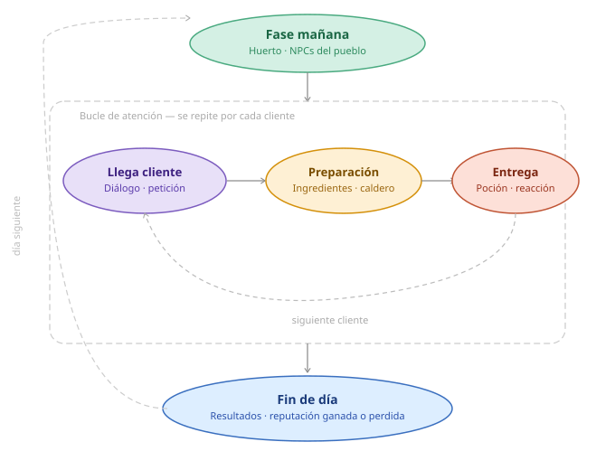

Este core-loop se repite durante **10 días** de juego.

## 3.	Mecánicas

### 3.1.	Diálogo

Todos los personajes que entran a la tienda interactúan con el jugador a través del mismo sistema base de diálogo para plantear su encargo. El pipeline completo es el siguiente:

**1. Selección de plantilla**

El sistema elige una plantilla de texto según la dificultad del día actual, definida en `daysConfig.json`. Existen 3 plantillas por nivel (`facil`, `medio`, `dificil`), cada una con una redacción progresivamente más críptica y literaria. La plantilla contiene 6 etiquetas dinámicas:

```
{saludo}  {raza_objetivo}  {color}  {sabor}  {consistencia}  {temperatura}  {forma_frasco}  {despedida}
```

**2. Sustitución de sinónimos**

Cada etiqueta se reemplaza por un término aleatorio del `diccionario.json` correspondiente a la dificultad activa. Por ejemplo, la etiqueta `{sabor}` con ingrediente *dulce*:

| Dificultad | Ejemplos de sustitución |
| :--- | :--- |
| `facil` | "un sabor dulce", "un gusto azucarado" |
| `medio` | "un toque empalagoso", "un regusto a miel" |
| `dificil` | "notas de néctar celestial", "un dulzor que empalague" |

Lo mismo aplica para `{color}`, `{consistencia}`, `{temperatura}`, `{forma_frasco}` y `{raza_objetivo}`. El jugador debe deducir el ingrediente correcto a partir del sinónimo, siendo este el núcleo del desafío en dificultades altas.

**3. Tono del diálogo**

`{saludo}` y `{despedida}` se eligen aleatoriamente de sus respectivos pools en el diccionario, independientes de la dificultad. Los saludos tienen 5 registros: *neutro, educado, borde, nervioso* y *misterioso*, lo que aporta variedad de personalidad sin afectar la mecánica.

**4. Ejemplo completo**

Un cliente en dificultad `dificil` con ingredientes *dulce / rojo / machacado / frío / corazón* podría generar:

> *"Los astros me han traído hasta aquí. Mi corazón ansía desesperadamente el afecto de una hija de las corrientes cristalinas. Requiere de tu mayor arte: un elixir con el color de la sangre que posea notas de néctar celestial. Confío en que la textura de la mezcla quede reducida a una pasta fina e irreconocible y que la poción repose fría como el hielo. Presérvalo en un vaso tallado con la silueta de un corazón. Confío en tu mano."*

---

### 3.2. Libro de Alquimia

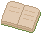 El jugador dispone de un libro interactivo que actúa como enciclopedia y guía para la creación de pociones. El libro se abre mediante la interacción con su modelo sobre el mostrador de la cocina y cuenta con un sistema de cuatro pestañas laterales de colores (roja, azul, verde y morada) para navegar entre sus páginas.
<br clear="left"/>

- **Página de Afinidad (1):** Permite consultar la compatibilidad amorosa entre las distintas razas. El jugador selecciona dos iconos de razas dispuestas en círculo; el sistema cruza los datos y revela un resultado visual en el centro que le indica qué probeta (olor) debe utilizar: tubo verde (afín), tubo gris (igual/neutro) o tubo rojo (hostil).
- **Páginas de Referencia (2, 3 y 4):** Funcionan como manuales estáticos. Detallan la relación entre cada ingrediente y su sabor correspondiente, las texturas que se consiguen según el procesado (entero, tabla de cortar o mortero), cómo conseguir colores secundarios mezclando tintes, el funcionamiento de la barra de temperatura del caldero y una guía visual para identificar la raza de los clientes normales según su vestimenta.

---

### 3.3. Preparación de pociones

La fase de creación de pociones se desarrolla en la vista de la cocina. El jugador interactúa con los ingredientes y herramientas mediante un sistema de *Drag & Drop* (arrastrar y soltar) con el ratón. Al coger un objeto, el sistema resalta visualmente (con un reborde) los lugares válidos donde puede ser soltado o procesado. El jugador debe combinar 5 atributos distintos en el caldero: olor, sabor, consistencia, color y temperatura.

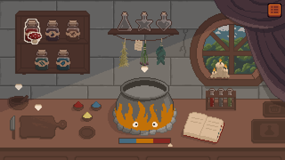

#### 3.3.1. Compatibilidad de razas (Olor)
El jugador debe seleccionar una de las tres probetas (roja, gris o verde) de la gradilla para dar olor a la poción, según lo consultado en el libro de afinidad. Se arrastra la probeta elegida hasta el caldero y se suelta.

#### 3.3.2. Plantas (Sabor y Consistencia)
El jugador selecciona 1 de las 5 plantas disponibles en los frascos (seta, baya, raíz, alga, cristal). La forma de procesar la planta determina su textura final, la cual puede requerir superar un minijuego:

- **Sin procesar (Textura sólida):** El jugador arrastra la planta elegida directamente al caldero, echándola entera.
- **Tabla de cortar (Textura cortada):** Al arrastrar la planta a la tabla, se inicia un minijuego. Aparece una barra horizontal dividida en tres segmentos con zonas oscuras aleatorias y una flecha desplazándose de un lado a otro. El jugador debe hacer clic exactamente cuando la flecha pase por las zonas marcadas para realizar 3 cortes exitosos.
- **Mortero (Textura machacada):** Al arrastrar la planta al mortero, inicia un minijuego de agilidad. Círculos semitransparentes aparecen en posiciones aleatorias de la pantalla y el jugador debe hacerles clic antes de que desaparezcan.

En ambos minijuegos, cometer errores (hacer clic fuera de las zonas, no realizar los cortes a tiempo o dejar desaparecer los círculos del mortero) aplica una penalización directa a la calidad de la poción final.

<p align="center">
  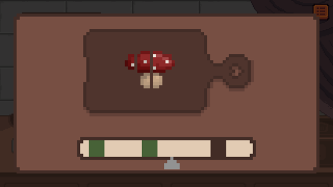
  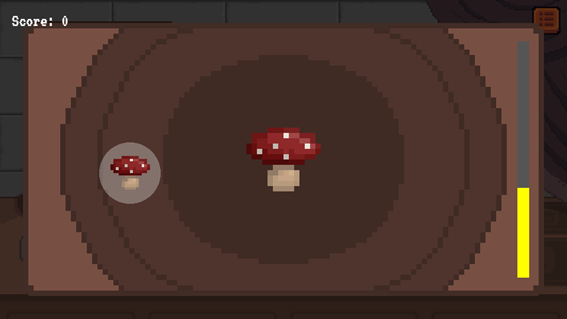
</p>

**Parámetros de Minijuegos:**
- **Penalización Tabla de Cortar:** -5% de calidad por clic fallido y por cada corte no realizado de los 3 requeridos.
- **Penalización Mortero:** -1% de calidad por cada círculo que el jugador deje desaparecer sin hacer clic.
- **Tiempo Límite Mortero:** 6000 milisegundos por sesión.

#### 3.3.3. Polvos (Color)
Existen tres cuencos con polvos de colores primarios (rojo, azul, amarillo).
- **Colores primarios:** Se arrastra el polvo directamente al caldero.
- **Colores secundarios (naranja, morado, verde):** El jugador debe arrastrar dos polvos primarios distintos al plato de mezclas de la mesa. Una vez combinados, se genera el color secundario que se puede arrastrar al caldero.

Si el jugador se equivoca de color en el plato de mezcla, puede arrastrar el polvo resultante a la papelera. Una vez el color se vierte en el caldero, este no se puede retirar sin desechar toda la poción.

#### 3.3.4. Fuego (Temperatura)
Al hacer clic sobre las piedras de la cocina, se enciende (o apaga) el fuego situado bajo el caldero. Mientras el fuego está encendido, una flecha en un medidor lateral subirá progresivamente, indicando la temperatura de la mezcla. El jugador debe apagar el fuego en el momento exacto para fijar la temperatura deseada.

Además, el fuego está vivo y posee personalidad: tiene ojos animados y suelta pequeños comentarios de texto (bocadillos) aleatorios durante el proceso, reaccionando de forma especial si el jugador permite que la temperatura llegue al máximo.

**Parámetros:**
- **Velocidad de cambio térmico:** +/- 0.005 unidades de temperatura por delta de tiempo.
- **Umbrales de temperatura:**
  - < 33.3% = Frío (`cold`)
  - < 66.6% = Templado (`warm`)
  - ≥ 66.6% = Caliente (`hot`)

#### 3.3.5. Envasado y Entrega (Forma del frasco)
Existen frascos vacíos con 3 formas distintas (normal, corazón y estrella). Una vez que el caldero tiene líquido, el jugador debe arrastrar el frasco correspondiente hacia el caldero. El frasco se llenará automáticamente con la mezcla actual. Posteriormente, el frasco lleno debe arrastrarse a la campana de entrega para dárselo al cliente, o a la papelera si el jugador sabe que ha cometido un error.

#### 3.3.6. Papelera (Descarte)
La papelera, situada en la parte derecha de la cocina, permite al jugador deshacerse de ingredientes procesados (cortados o machacados), de polvos mal mezclados en el platito, o de pociones ya envasadas que sean incorrectas, permitiendo al jugador reiniciar el proceso sin penalización (más allá de la pérdida de tiempo que supone volver a empezar).

---

### 3.4. Sistemas de evaluación y puntuación

El rendimiento del jugador se evalúa en dos fases secuenciales: primero se calcula la **calidad de la poción** creada y, posteriormente, esa calidad (junto al tiempo invertido) determina el cambio en la **reputación de la tienda**.

#### 3.4.1. Calidad de la Poción (0% - 100%)
Todas las pociones comienzan su elaboración con una calidad base del 100%. Este porcentaje puede verse reducido por dos factores principales:

1. **Penalizaciones de Procesado (Minijuegos):** Los errores cometidos durante la fase de preparación de ingredientes (fallos en la tabla de cortar o en el mortero) restan puntos directamente a la calidad base de la poción en tiempo real.
2. **Evaluación de la Receta:** En el momento de la entrega, el sistema compara el contenido del caldero y el frasco elegido con los requisitos del cliente. Se restan **20 puntos de calidad** por cada uno de los siguientes fallos:
   * Color incorrecto.
   * Sabor o consistencia ausentes o incorrectos.
   * Olor (probeta de afinidad) incorrecto.
   * Temperatura incorrecta al momento de envasar.
   * Forma del frasco incorrecta.
   * **Ingredientes sobrantes:** Se restan 20 puntos adicionales por cada atributo o sabor extra que se haya añadido al caldero y que el cliente no haya pedido.

Si el jugador entrega un frasco vacío, la calidad de la poción se fija automáticamente en 0%. La calidad mínima posible siempre será 0%.

#### 3.4.2. Sistema de Reputación
La reputación es la "vida" de la tienda, comenzando el día 1 en 20 puntos. Tras entregar una poción, la calidad final determina el cambio en la reputación del jugador según los siguientes rangos:

* **100% (Poción Perfecta):** +10 puntos de reputación.
* **80% - 99% (Poción Excelente):** +5 puntos de reputación.
* **50% - 79% (Poción Aceptable):** +1 punto de reputación.
* **20% - 49% (Poción Deficiente):** -5 puntos de reputación.
* **< 20% o Vacía (Poción Desastrosa):** -15 puntos de reputación.

#### 3.4.3. Bonificadores y Penalizaciones Adicionales
* **Control de Tiempos:** Si la poción entregada es válida (Calidad >= 50%), el sistema evalúa el tiempo invertido desde que el cliente hizo el encargo.
  * **Servicio rápido (<= 30 segundos):** Bonificación de +2 puntos de reputación.
  * **Servicio lento (>= 120 segundos):** Penalización de -2 puntos de reputación.
  * *(El tiempo que el juego pasa pausado en el menú o en cuenta atrás de minijuegos no contabiliza para este cálculo).*
* **Mantenimiento del Huerto:** Al finalizar el día, se comprueba el estado de los dos huertos del pueblo. Por cada huerto que el jugador no haya regado, sufrirá una penalización de **-5 puntos de reputación** al cierre de la jornada (máximo -10 puntos). Esta mecánica no se aplica durante el Día 1.

#### 3.4.4. La Reputación y sus Consecuencias

La reputación no es solo un marcador de rendimiento: determina directamente el desenlace de la partida y el estado del mundo en el top-down.

**Desbloqueo de personajes en la ciudad**
Atender correctamente (calidad ≥ 80%) a un cliente especial desbloquea su aparición permanente en el mapa top-down, donde podrá ser visitado para obtener diálogos adicionales de lore.

**Finales posibles**

* **Final Malo (Reputación ≤ -60):** La Guardia Real llama a la puerta. El Inspector Real entra y declara la clausura inmediata de la tienda, desterrando a la protagonista del pueblo. La partida guardada se borra.

* **Final Intermedio (Día 15 completado sin cumplir las condiciones del final bueno):** La tía Agatha llama a la puerta y recupera la tienda. La protagonista no ha conseguido ganarse del todo su lugar en el pueblo. La partida guardada se borra.

* **Final Bueno — Variante Feliz (Día 15 completado + ≥ 5 visitas a la madre + reputación ≥ 170 + poción final a la madre con calidad ≥ 80%):** La madre aparece como cliente final. Si la poción que le entregamos es de calidad suficiente, se desvela su identidad y la historia concluye de forma óptima.

* **Final Bueno — Variante Agridulce (mismas condiciones pero poción final < 80%):** La madre aparece igualmente, pero el desenlace deja una sensación incompleta al no haber conseguido la poción perfecta en el momento decisivo.

---

### 3.5. Sistema de Guardado y Progresión

El progreso de la partida se almacena de forma persistente en el navegador del jugador, lo que permite cerrar el juego y retomar la partida exactamente en el mismo día durante futuras sesiones.

#### 3.5.1. Guardado Automático
El juego no requiere que el jugador guarde manualmente. El guardado se realiza de forma automática **al finalizar cada jornada laboral**:
- Se activa en la pantalla de **Resumen Diario**, justo al hacer clic para avanzar al día siguiente.
- Se muestra un pequeño mensaje en pantalla ("¡Progreso guardado!") para dar *feedback* visual al jugador antes de pasar a la siguiente escena.

#### 3.5.2. Qué datos se conservan
Para mantener la coherencia narrativa y mecánica, el sistema guarda exclusivamente el estado general del juego entre días (no se guardan pociones a medias ni acciones a mitad de jornada). Se conserva:
- **El progreso general:** Día actual, puntuación de reputación y si ya se ha completado el tutorial.
- **El progreso narrativo:** Las conversaciones que ya se han tenido con los habitantes del pueblo (para que los NPCs no repitan sus diálogos de presentación) y el resultado de los encargos de los Clientes Especiales.
- **El arco de la Madre:** El número de visitas realizadas a la cueva, un factor esencial para desbloquear el final de la historia.

#### 3.5.3. Pantalla de Título
Al abrir el juego, la pantalla de inicio detecta automáticamente si existe un progreso guardado:
- **Continuar:** Si hay datos previos, aparece un botón de "CONTINUAR" que indica el día exacto por el que va el jugador, llevándolo directamente a su casa al inicio de esa jornada.
- **Nueva Partida:** Si el jugador selecciona "Nueva Partida" (o "Jugar" si es la primera vez), la historia comienza de cero. Si ya existía un progreso anterior, este se borra de forma irreversible para evitar conflictos.

### 3.6. Diálogo con los personajes en la ciudad

<p align="center">
  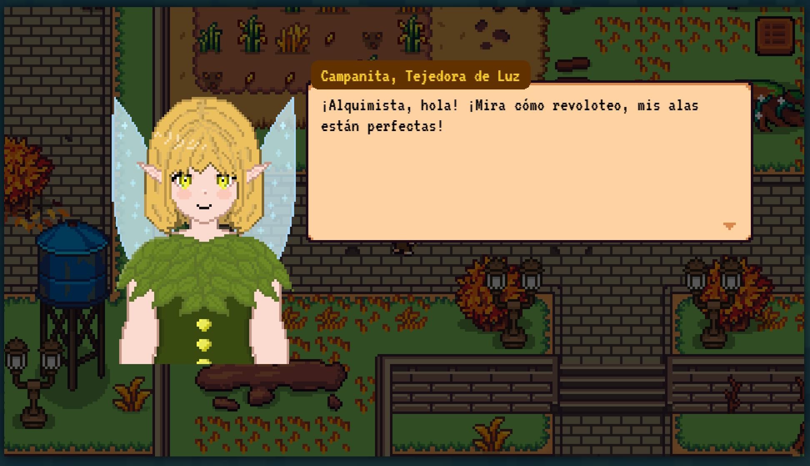
</p>

Ciertos `personajes especiales` de cada raza del juego nos traerán nuevas historias cuando aparezcan en nuestra tienda, y se `desbloquearán en nuestra ciudad` una vez les hayamos atendido correctamente. Estos tendrán divertidos diálogos que nos hablarán más sobre nuestra función en esta sociedad mágica y como vamos fomentando la diversidad y la buena relación entre todas las razas fantásticas. Estos personajes tendrán un `dialogo inicial` y después seguiran contándonos lo mismo las veces que hablemos con ellos.


#### 3.6.1. Diálogos con la mujer misteriosa en la cueva

<p align="center">
  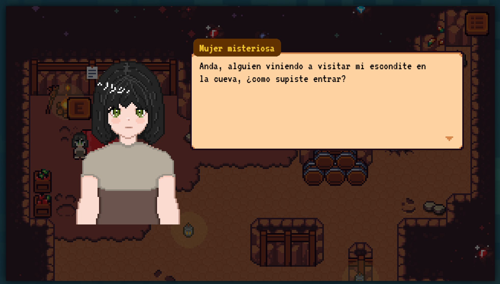
</p>

Desde el primer día de juego encontraremos una `mujer misteriosa`en la `cueva` cercana a la tienda. Si hablamos con ella nos irá contando más información de quién es y de su papel en la historia. Si la visitamos `varios días` sabremos finalmente su identidad y ¡habremos forjado una buena amistad con ella!

## 4.	Interfaz

### 4.1.	Controles
#### 4.1.1.	TopDown

Usamos las teclas `wasd`para el movimiento o el `ratón`, implementando la mecánica de `click and go` calculando las rutas evitando colisiones con `navmesh`. También usamos la tecla `E`para interactuar con los personajes o objetos interactuables del mapa, unque estos también se pueden activar con `click`. Por último tenemos la tecla `ESC` para abrir el menú de pausa.

#### 4.1.2.	No TopDown

Usamos el `ratón` para interactuar con todo lo que aparece por pantalla, asi como la tecla `ENTER` para avanzar los diálogos. En aslgunas escenas también podemos abrir el menu de pausa con la tecla `ESC`. 

### 4.2.	Cámara 
CONSULTA: Cámara fija y vista en primera persona. <br/>
PUEBLO: Vista top-down.

### 4.3.  Pantallas y menús

#### Pantalla de Resumen Diario

<p align="center">
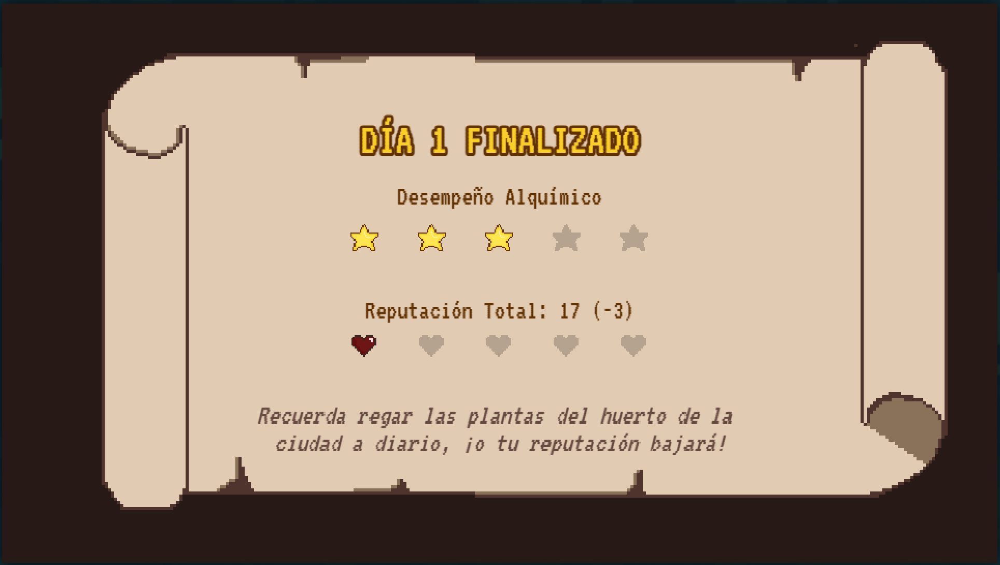
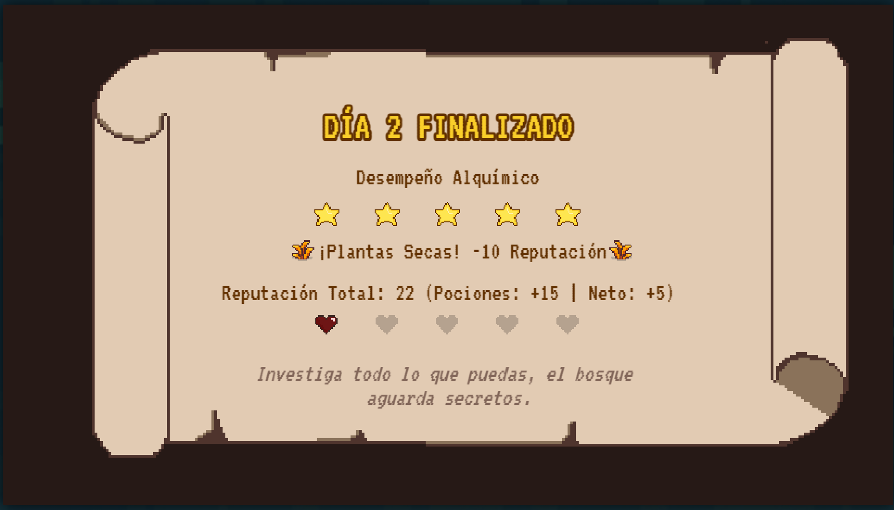
</p>

Al finalizar cada jornada se muestra una pantalla de resumen con los siguientes elementos:

- **Título** — indica el número de día finalizado.
- **Estrellas de desempeño** — fila de 5 estrellas que refleja la calidad general de las pociones servidas durante el día.
- **Reputación** — muestra la reputación total acumulada y la variación neta del día. Si el huerto no fue regado, se desglosa por separado la penalización de plantas secas respecto a los puntos obtenidos por pociones.
- **Corazones de reputación** — fila de 5 corazones que representa visualmente el nivel de reputación actual.
- **Consejo del día** — texto rotatorio con un tip narrativo que aparece con efecto de escritura progresiva. Rota en ciclo entre 6 mensajes según el día.
- **Guardado automático** — al hacer clic para continuar, el progreso se guarda automáticamente y se muestra una confirmación en pantalla antes de pasar al siguiente día.

#### Pantalla de Menú de Pausa

<p align="center">
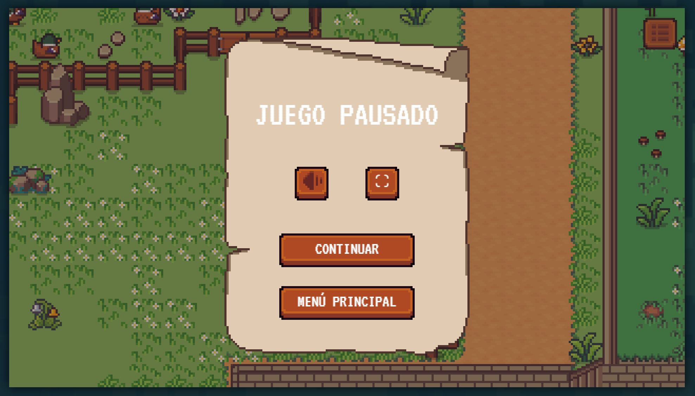
</p>

Este Menú se puede abrir desde casi todas las escenas del juego, a traves de pulsar el botón de la esquina superior derecha o de la tecla `esc`
En el podemos pausar la partida y modificar aspectos del gameplay como puede ser la `pantalla completa` o la opción de `mute`.
Además nos permite volver al menú principal.

## 5.	Mundo del juego
### 5.1.	Personajes
#### 5.1.1. Razas
- Humanos
- Hadas (aire)
- Ninfas (agua)
- Kitsunes (fuego)
- Elfos (planta)
- Gnomos (tierra)

#### 5.1.2. Compatibilidad
| | Humanos | Hadas | Ninfas | Kitsunes | Elfos | Gnomos |
| :--- | :---: | :---: | :---: | :---: | :---: | :---: |
| **Humanos** | 🟢 | 🟢 | ⚪ | ⚪ | 🔴 | 🔴 |
| **Hadas** | 🟢 | 🟢 | 🔴 | ⚪ | ⚪ | 🔴 |
| **Ninfas** | ⚪ | 🔴 | 🟢 | 🔴 | 🟢 | ⚪ |
| **Kitsunes** | ⚪ | ⚪ | 🔴 | 🟢 | 🔴 | 🟢 |
| **Elfos** | 🔴 | ⚪ | 🟢 | 🔴 | 🟢 | ⚪ |
| **Gnomos** | 🔴 | 🔴 | ⚪ | 🟢 | ⚪ | 🟢 |

> 🟢 = Buena <br/> ⚪ = Neutra <br/> 🔴 = Mala

#### 5.2. Clientes
Los clientes son el motor narrativo y mecánico de la tienda. Acuden a la consulta buscando ayuda mágica para sus problemas y se dividen en dos grandes categorías, compartiendo un mismo núcleo para procesar sus textos.

#### 5.2.1. Clientes Normales
Son la principal fuente de ingresos y reputación durante el bucle de juego diario, manteniendo el flujo constante de la consulta.

* **Generación Modular:** Su aspecto se construye de forma dinámica. El sistema ensambla partes intercambiables. Primero el tono de piel, que se usa para elegir cuerpo, nariz y boca; un peinado; un color para pelo, cejas y otros features que lo requieran, color de ojos y ropa de la raza seleccionada aleatoriamente.

Aquí una tabla con todas los sprites utilizados para los clientes:

---

##### Cuerpos Base

| Capa | Opción 1 | Opción 2 | Opción 3 |
| :--- | :---: | :---: | :---: |
| **Cuerpos** |  | 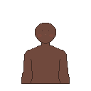 | 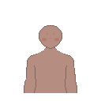 |

---

##### Ropa por Raza

| Raza | Vista |
| :--- | :---: |
| **Elfo** | 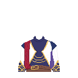 |
| **Gnomo** | 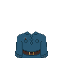 |
| **Hada** | 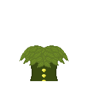 |
| **Humano** | 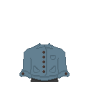 |
| **Kitsune** | 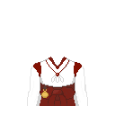 |
| **Madre** | 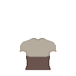 |
| **Ninfa** | 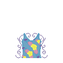 |

---

##### Features Especiales por Raza

| Raza | Vista |
| :--- | :---: |
| **Gnomo** |  |
| **Hada** | 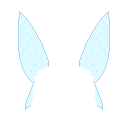 |
| **Ninfa** |  |
| **Kitsune** — Azul | 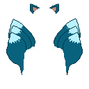 |
| **Kitsune** — Negro | 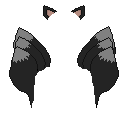 |
| **Kitsune** — Rojo | 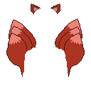 |
| **Kitsune** — Rosa | 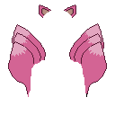 |
| **Kitsune** — Rubio | 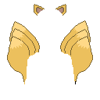 |
| **Kitsune** — Verde | 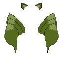 |

---

##### Ojos

| Capa / Color | Vista |
| :--- | :---: |
| **Amarillos** | 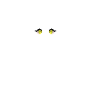 |
| **Azules** | 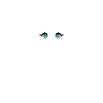 |
| **Marrones** |  |
| **Rojos** |  |
| **Rosas** | 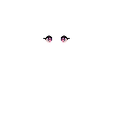 |
| **Verdes** |  |
| **Enfadados** |  |
| **Felices** |  |

---

##### Pelo — Estilo 1

| Color | Vista |
| :--- | :---: |
| **Azul** |  |
| **Negro** |  |
| **Rojo** | 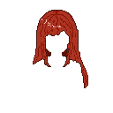 |
| **Rosa** | 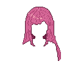 |
| **Rubio** | 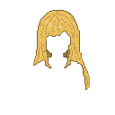 |
| **Verde** | 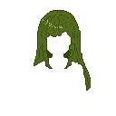 |

##### Pelo — Estilo 2

| Color | Vista |
| :--- | :---: |
| **Azul** |  |
| **Gris** |  |
| **Negro** | 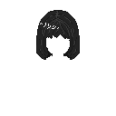 |
| **Rojo** | 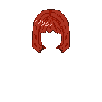 |
| **Rosa** |  |
| **Rubio** | 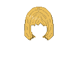 |
| **Verde** | 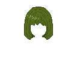 |

##### Pelo — Estilo 3

| Color | Vista |
| :--- | :---: |
| **Azul** |  |
| **Negro** |  |
| **Rojo** | 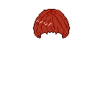 |
| **Rosa** | 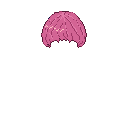 |
| **Rubio** |  |
| **Verde** | 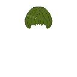 |

---

##### Cejas

| Color | Vista |
| :--- | :---: |
| **Azules** |  |
| **Negras** |  |
| **Rojas** |  |
| **Rosas** |  |
| **Rubias** |  |
| **Verdes** |  |

---

##### Bocas

| Expresión | Vista |
| :--- | :---: |
| **Feliz** |  |
| **Enfadada** |  |
| **Normal 1** |  |
| **Normal 2** |  |
| **Normal 3** |  |

---

##### Narices

| Variante | Vista |
| :--- | :---: |
| **Variante 1** |  |
| **Variante 2** |  |
| **Variante 3** |  |

---

##### Orejas

| Tipo | Opción 1 | Opción 2 | Opción 3 |
| :--- | :---: | :---: | :---: |
| **Elfo / Hada** |  |  |  |
| **Ninfa** |  |  |  |

---

##### Accesorios Especiales

| Accesorio | Vista |
| :--- | :---: |
| **Gafas** |  |
| **Gorro Inspector** |  |

---

* **Construcción por Plantillas Aleatorias:** Los requisitos de su poción se deciden completamente al azar. Para generar su texto de presentación, el juego elige y une plantillas aleatorias. Una vez montada la estructura, se le aplica el sistema general de sustitución de sinónimos.
* **Reacción:** Sus respuestas al recibir la poción son puramente visuales y mecánicas (animaciones genéricas de celebración o enfado), **sin requerir diálogos de desenlace**.

#### 5.2.2. Clientes Especiales (Scriptados)
Personajes únicos con diseños fijos y motivaciones específicas que aportan lore y contexto sobre el mundo del juego. Toda su lógica narrativa se controla desde archivos de configuración centralizados.
* **Textos Fijos:** A diferencia de los [clientes normales](#5.2.1.-clientes-normales), estos personajes no eligen una plantilla aleatoria; su diálogo de presentación está completamente personalizado para narrar su trasfondo e historia personal. Sin embargo, **sí que utilizan el sistema general de sinónimos**: sus textos contienen las mismas etiquetas dinámicas para que las pistas de los ingredientes cambien según la dificultad seleccionada.
* **Diálogos de Resolución:** Cuentan con líneas de texto adicionales tras recibir el encargo. El sistema evalúa la calidad de la mezcla y desencadena una de tres respuestas exclusivas:
  * **Éxito (Calidad >= 80%):** El cliente resuelve su problema de forma óptima y aparecerán en la zona topdown.
  * **Neutral (Calidad 50% - 79%):** El resultado es pasable. Soluciona el problema a medias, dejando una sensación agridulce.
  * **Fracaso (Calidad < 50%):** La poción resulta perjudicial, empeorando la situación del cliente y afectando gravemente la reputación.
* **Animaciones Únicas:** Ejecutan comportamientos físicos exclusivos según la situación, como animaciones en bucle durante su espera o salidas animadas.

#### 5.2.3. Clientes Especiales (Scriptados)

Personajes únicos con diseños fijos y motivaciones específicas que aportan lore y contexto sobre el mundo del juego. Toda su lógica narrativa se controla desde `scriptedNpcs.json`.

---

###### Ezarel, el Casanova

> *"Demuéstrame lo que vales, joven alquimista."*

Elfo de clase alta con una larga relación con la tienda, ya que era cliente habitual de la tía Agatha. Acude antes de cada cita para asegurarse de tener ventaja, aunque atribuye todo el mérito de sus conquistas a su "encanto natural". Es el primer cliente especial que visita la consulta y actúa como introducción al sistema de diálogos scriptados. Si se le atiende bien, revela la existencia de la cueva del oeste, clave para encontrar a la madre.

**Sprite completo:** 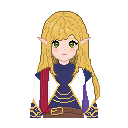

**Animación topDown:** 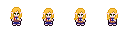

**Poción requerida:** Raza objetivo: elfos · Sabor: dulce · Color: rojo · Consistencia: entera · Temperatura: frío · Frasco: estrella

---

###### Thalassa de las Aguas Claras

> *"Las raíces oscuras están envenenando el río..."*

Ninfa que ha forjado una alianza secreta con humanos para purificar los manantiales del bosque antes de que una oscuridad desconocida los destruya. Su encargo no es romántico en apariencia, sino que el catalizador mágico que necesita para el ritual de purificación resulta ser también un filtro de amor. Representa la tensión entre las razas y su capacidad de cooperar ante una amenaza común.

**Sprite completo:** 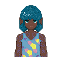

**Animación topDown:** 

**Poción requerida:** Raza objetivo: humanos · Sabor: salado · Color: azul · Consistencia: cortada · Temperatura: del tiempo · Frasco: corazón

---

###### David, ¿el gnomo?

> *"Soy ese cono parlante de ahí abajo."*

Gnomo enamorado de una elfa que literalmente no le ve, ya que le pasa por alto debido a su estatura. Acude a la tienda buscando un "estirón mágico" que le permita estar a la altura (en todos los sentidos) de su pretendida. Su historia es la más cómica del juego y cuenta con una animación de éxito exclusiva en la que crece visiblemente al tomar la poción.

**Sprite completo:** 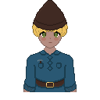

**Animación topDown:** 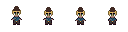

**Poción requerida:** Raza objetivo: elfos · Sabor: dulce · Color: rojo · Consistencia: cortada · Temperatura: frío · Frasco: estrella

---

###### Campanita, Tejedora de Luz

> *"Mis alas se han vuelto rígidas y he perdido la capacidad de alzar el vuelo."*

Hada alegre y parlanchina con una cita pendiente en lo alto de una montaña con un gnomo al que está enseñando a perder el vértigo. El problema: sus alas se han vuelto rígidas y no puede volar. Necesita una poción que restaure su aleteo a tiempo. Su animación de espera muestra las alas batiendo en bucle, y su salida de éxito es la única del juego en la que el personaje sale volando literalmente por arriba de la pantalla.


**Sprite completo:** 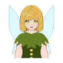

**Animación topDown:** 

**Poción requerida:** Raza objetivo: gnomos · Sabor: ácido · Color: amarillo · Consistencia: machacada · Temperatura: frío · Frasco: estrella

---

###### Kaelen el Errante

> *"Tu mirada me sigue resultando muy familiar."*

Humano que ha viajado semanas desde su aldea, cuyas cosechas se marchitan bajo una plaga desconocida. Busca el poder purificador de las ninfas para salvar a su pueblo. Es uno de los personajes con más carga narrativa implícita: sus comentarios sobre "una chica de su aldea que desapareció" y la familiaridad que siente con la protagonista apuntan a una conexión con el lore de la madre. Si se le atiende bien, se queda en el pueblo cercano disponible para hablar.

**Sprite completo:** 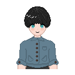

**Animación topDown:** 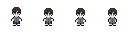

**Poción requerida:** Raza objetivo: ninfas · Sabor: amargo · Color: verde · Consistencia: machacada · Temperatura: calor · Frasco: normal

---

###### Akira, Sombra del Templo

> *"Los faroles de nuestro santuario ancestral se han apagado."*

Kitsune de carácter frío y ceremonioso. Los faroles de su santuario ancestral se han apagado y, según la tradición, solo la chispa de un hada puede devolver el fuego espiritual. Acude a la tienda sin mostrar emociones, pero si se le atiende bien revela un lado más cercano y ofrece enseñar "trucos interesantes" a la protagonista. Es el personaje con el tono más solemne y misterioso de todos los scriptados.

**Sprite completo:** 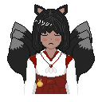

**Animación topDown:** 

**Poción requerida:** Raza objetivo: hadas · Sabor: umami · Color: naranja · Consistencia: cortada · Temperatura: calor · Frasco: estrella

---

###### Inspector Real

> *"Por orden del alcalde, esta tienda queda clausurada de inmediato."*

No es un cliente al uso, sino el desenlace negativo del juego. Aparece si la reputación de la protagonista cae demasiado. No hace ningún encargo: simplemente entra, declara la clausura de la tienda y destierra a la protagonista del pueblo. No tiene diálogo de resolución ni aparece en el top-down.

**Sprite completo:**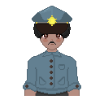

---

###### Mujer Misteriosa

> *"Hola, hija mía. Ha llegado el momento de dejar de esconderme en esta cueva."*

Personaje central del arco narrativo principal, aunque su verdadera identidad solo se desvela tras múltiples visitas a la cueva del oeste. Se presenta como una mujer misteriosa que vive escondida, y a lo largo de 5 visitas progresivas va revelando su historia: es la madre de la protagonista, humana que se enamoró del anterior rey de los elfos y tuvo que desaparecer para protegerse. Su diálogo en el top-down es el único del juego que avanza de forma secuencial visita a visita, revelando el lore de la protagonista de forma gradual.

**Sprite completo:**

**Animación topDown:** 

**Poción requerida:** Raza objetivo: elfos · Sabor: dulce · Color: rojo · Consistencia: machacada · Temperatura: calor · Frasco: corazón

---

###### Tía Agatha

> *"Creo que es hora de que esta tienda pase a ser tuya."*

No aparece como cliente sino como personaje de cierre narrativo. Es la propietaria original de la tienda y quien la dejó a cargo de la protagonista. Aparece al final del juego para ceder oficialmente la tienda, reconocer el trabajo realizado y quedarse como apoyo permanente. Junto a la madre, forma el núcleo del arco narrativo de la protagonista.

**Sprite completo:** 

### 5.2.	Objetos
#### 5.2.1 Cocina

- Probetas

| | Roja | Gris | Verde |
| :--- | :---: | :---: | :---: |
| **Sprite** |  |  |  |

- Ingredientes

| | Seta | Bayas | Raíz | Algas | Cristal |
| :--- | :---: | :---: | :---: | :---: | :---: |
| **Sabor** | Umami | Ácido | Amargo | Dulce | Salado |
| **Sprite 1** |  |  |  |  |  |
| **Sprite 2** |  |  |  |  |  |

- Polvos

| | Rojo | Azul | Amarillo |
| :--- | :---: | :---: | :---: |
| **Sprite** |  |  |  |

- Frascos

| | Normal | Corazón | Estrella |
| :--- | :---: | :---: | :---: |
| **Sprite** |  |  |  |

## 6. Estética y contenido
### 6.1. Dirección artística

Don't Kill My Date ! utiliza una dirección artística pixel art inspirada en la fantasía medieval y en los juegos cozy de simulación y gestión. El objetivo visual es transmitir una sensación acogedora y mágica, mezclando humor, alquimia y vida cotidiana dentro de un pequeño pueblo fantástico.

El juego combina elementos visuales cálidos y relajantes con detalles caricaturescos y expresivos, especialmente en los objetos interactivos de la cocina y en algunos personajes especiales.

La estética general busca:

transmitir comodidad visual,
facilitar la lectura rápida de ingredientes y herramientas,
y reforzar el tono ligero y humorístico de la narrativa.
### 6.2. Estilo visual

El apartado visual se divide en dos bloques principales con identidades diferenciadas.

#### Cocina / Consulta

La preparación de pociones ocurre en una vista fija inspirada en juegos de gestión clásicos y novelas visuales.

La escena utiliza:

- Interiores medievales de piedra y madera
- Iluminación cálida,
- Decoración alquímica
- Objetos interactivos detallados
- Animaciones ambientales

El caldero y el fuego funcionan como elementos centrales de la composición visual. El fuego posee personalidad propia mediante ojos animados y pequeños comentarios, reforzando el tono cómico del juego.

La interfaz se integra directamente en el escenario mediante elementos diegéticos:

- Estanterías
- Libros
- Frascos
- Ingredientes
- Herramientas físicas visibles en pantalla
  
#### Exploración Top-Down

La exploración exterior utiliza una vista cenital (top-down) inspirada en simuladores de vida y granja.

El pueblo presenta:

- Caminos de tierra
- Vegetación abundante
- Cultivos
- Casas de madera
- Elementos naturales distribuidos para reforzar la sensación de entorno rural vivo

La paleta de colores utiliza verdes, marrones y amarillos saturados para crear un ambiente agradable y luminoso.

Esta sección funciona como espacio de relajación y exploración narrativa entre jornadas de trabajo dentro de la tienda.

### 6.3. Diseño de personajes

Los personajes combinan proporciones simples con rasgos visuales exagerados y fácilmente reconocibles.

Los NPCs normales utilizan un sistema modular basado en capas:

- Peinados
- Ojos
- Ropa
- Accesorios
- Colores
- Elementos raciales

Esto permite generar una gran variedad de clientes manteniendo coherencia estética.

Por otro lado, los personajes especiales poseen ilustraciones y sprites únicos más detallados, reforzando su importancia narrativa.

### 6.4. Interfaz y UX visual

La interfaz utiliza marcos, botones y cajas de diálogo inspirados en RPGs clásicos y juegos Flash de gestión.

Se prioriza:

- Legibilidad
- Contraste alto
- Navegación simple
- Feedback visual inmediato

Las cajas de diálogo grandes y el uso de tipografía pixelada ayudan a mantener la coherencia estética general.

### 6.5. Sonido y música

La ambientación sonora está inspirada en fantasía medieval ligera y juegos cozy.

La música utiliza melodías suaves y relajadas durante la exploración, mientras que en la cocina el ritmo se vuelve más dinámico para acompañar la presión de los minijuegos y la preparación de pociones.

Los efectos de sonido refuerzan la interacción con los objetos:

- Burbujeos
- Fuego
- Golpes de mortero
- Cortes
- Sonidos ambientales
- Reacciones de clientes

## 7. Experiencia de juego

La experiencia de Don't Kill My Date ! se centra en combinar relajación, humor y gestión ligera dentro de un entorno fantástico acogedor.

El juego alterna constantemente entre dos ritmos distintos:

- Una fase de concentración y presión suave dentro de la cocina
- Una fase tranquila de exploración y diálogo en el pueblo

Este contraste busca evitar la repetición y mantener una progresión dinámica durante toda la partida.

#### Sensaciones buscadas

El diseño del juego intenta transmitir:

- Satisfacción al preparar correctamente una poción,
- Descubrimiento progresivo de mecánicas y personajes,
- Apego al pueblo y sus habitantes,
- Curiosidad por el misterio principal de la protagonista.

El jugador mejora poco a poco interpretando pistas más complejas, optimizando tiempos y comprendiendo mejor las relaciones entre razas y personajes.

#### Ritmo de juego

El gameplay sigue un ciclo diario estructurado:

- Atención de clientes
- Preparación de pociones
- Evaluación de resultados
- Progresión narrativa
- Exploración y cuidado del pueblo

Este bucle busca generar una sensación de rutina acogedora similar a juegos de simulación de vida.

#### Dificultad

La dificultad aumenta progresivamente mediante:

- Diálogos más ambiguos
- Clientes más complejos
- Necesidad de memorizar sistemas
- Penalizaciones derivadas de errores o mala gestión del tiempo

Aun así, el juego mantiene un tono accesible y casual durante toda la experiencia.

## 8.	Producción

### 8.1. Herramientas utilizadas

El proyecto ha sido desarrollado utilizando:

- Phaser como motor principal
- JavaScript para la lógica de programación
- Libresprite para la creación de sprites y animaciones pixel art
- Tiled para la creación de mapas
- GitHub para control de versiones y trabajo colaborativo.
  
### 8.2. Organización del equipo

El desarrollo se dividió en distintas áreas:

- Programación de mecánicas
- Arte y animación
- Narrativa y diseño de diálogos
- Sonido
- Interfaz

El trabajo se realizó de forma iterativa, comenzando por las mecánicas principales de la cocina y expandiendo posteriormente el contenido narrativo y la exploración top-down.

### 8.3. Pipeline artístico

El arte se desarrolló siguiendo dos pipelines visuales distintos:

- Sprites detallados para la cocina, mostrador, personajes y objetos
- Tilesets para el mundo top-down.

Los personajes normales utilizan composición modular mediante capas para generar variedad visual automáticamente.

## 9. Playtest

El 16 de abril de 2026 llevamos a cabo una sesión de playtest con **5 personas** durante sesiones de juego de entre 10 y 20 minutos. El objetivo fue poner a prueba el *core loop* de la cocina y la exploración del mapa.

### Análisis de los Resultados
* **Desempeño:** Los jugadores jugaron el tutorial e iniciaron el Día 1 con una reputación base de 50. La mayoría logró completar las 2 peticiones con éxito y ganar reputación, pero observamos una discrepancia clara: los jugadores con experiencia previa en este tipo de juegos superaron los retos sin problemas, mientras que un perfil de jugador menos habituado tuvo dificultades críticas, llegando a fallar casi todos los ingredientes de la poción (ya que no leyeron con tanta atención los diálogos del tutorial). Esto nos confirmó que la curva de aprendizaje es sensible al perfil del jugador.
* **Debate sobre la Ayuda Visual:** Surgió un debate importante sobre si el jugador debía saber qué ingredientes había introducido en el caldero. Tras contrastar el feedback de los jugadores con la opinión del profesorado, hemos decidido **mantener la dificultad sin ayudas visuales**. Creemos que forzar la memoria del jugador añade un nivel de reto necesario para la experiencia.
* **Puntos Críticos Detectados:**
    * **Identificación de razas:** Los jugadores fueron incapaces de distinguir las razas de los clientes, lo que invalidaba la utilidad del libro de afinidades.
    * **Poco feedback en el resultado de la poción:** La mayoría de jugadores sintieron que no recibían suficiente feedback si hacías bien o mal la poción.
    * **Exploración Top-Down:** En ese estado del desarrollo, al estar la zona *top-down* poco desarrollada (limitada a la interacción con la cueva y vallas), los usuarios no entendían su propósito ni qué podían hacer en ella.
    * **Diseño visual:** Dos de las probetas de olor eran cromáticamente demasiado similares, provocando confusión a la hora de seleccionarlas.

### Decisiones de Diseño y Cambios Implementados
A raíz de los resultados, hemos realizado las siguientes mejoras:

1.  **Libro de Alquimia:** Hemos incluido fotos de referencia en el libro vinculando la vestimenta a cada raza, eliminando la ambigüedad al identificar clientes.
2.  **Feedback post-jornada:** Para solucionar la falta de información tras entregar pociones, hemos diseñado una **pantalla de resumen al final del día**, resolviendo la necesidad de feedback que los jugadores demandaban.
3.  **Tutorial:** Aunque el tutorial estaba en fases iniciales, hemos corregido su base para que sea menos genérico. Ahora implementamos un **resaltado visual en amarillo** sobre los objetos con los que el jugador debe interactuar, asegurando que nadie se sienta perdido.
4.  **Guía en el Top-Down:** Hemos añadido indicadores visuales (la tecla "E") sobre todos los objetos con los que se puede interactuar. Además, hemos enriquecido los diálogos de los personajes y los textos del resumen diario para que funcionen como pistas contextuales, indicando al jugador qué objetivos puede cumplir en el mapa.
5.  **Ajuste de Recursos:** Hemos modificado el color de una de las probetas para asegurar una distinción más clara entre ellas.

## 10. Referencias

#### Referencias visuales y artísticas
- Stardew Valley
- Potion Craft
- Good Pizza, Great Pizza
- Papers, Please

  
#### Referencias jugables y narrativas
- La exploración del pueblo, el huerto y la ambientación cozy están inspiradas en Stardew Valley.
- La alquimia, la elaboración de pociones y la estética medieval fantástica toman referencias directas de Potion Craft.
- El sistema de atención a clientes, gestión de pedidos y estructura basada en jornadas está inspirado en Good Pizza, Great Pizza o Papa´s Freezeria.
- El componente narrativo, la toma de decisiones, la existencia de múltiples finales y los personajes especiales con historias propias se inspiran en Papers, Please. Además, la necesidad de interpretar correctamente las peticiones de los clientes mediante pistas y diálogos también toma influencia de este título.

#### Copyright

This software includes code from "navmesh"
https://github.com/mikewesthad/navmesh

Copyright (c) Mike Westhad

Licensed under the MIT License:

MIT License

Copyright (c) 2017 Michael Hadley

Permission is hereby granted, free of charge, to any person obtaining a copy
of this software and associated documentation files (the "Software"), to deal
in the Software without restriction, including without limitation the rights
to use, copy, modify, merge, publish, distribute, sublicense, and/or sell
copies of the Software, and to permit persons to whom the Software is
furnished to do so, subject to the following conditions:

The above copyright notice and this permission notice shall be included in all
copies or substantial portions of the Software.

THE SOFTWARE IS PROVIDED "AS IS", WITHOUT WARRANTY OF ANY KIND, EXPRESS OR
IMPLIED, INCLUDING BUT NOT LIMITED TO THE WARRANTIES OF MERCHANTABILITY,
FITNESS FOR A PARTICULAR PURPOSE AND NONINFRINGEMENT. IN NO EVENT SHALL THE
AUTHORS OR COPYRIGHT HOLDERS BE LIABLE FOR ANY CLAIM, DAMAGES OR OTHER
LIABILITY, WHETHER IN AN ACTION OF CONTRACT, TORT OR OTHERWISE, ARISING FROM,
OUT OF OR IN CONNECTION WITH THE SOFTWARE OR THE USE OR OTHER DEALINGS IN THE
SOFTWARE.

