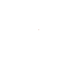

# GDD

### Equipo de desarrollo:
Programación y arte: Diego Barba, Laura Valles y Alba Gómez.   Programación y sonido: Sergio Casanova.   Programación: Lucas Suárez y María Bravo.

## 1.	Resumen
### 1.1.	Descripción
<i>Don't Kill My Date !</i> es un videojuego en el que el jugador encarna a un hechicero que dirige una consulta en un pequeño pueblo. Allí acuden clientes con disputas románticas, a quienes ayuda creando pociones adaptadas a sus necesidades mediante la selección y preparación de distintos ingredientes.

La combinación de ingredientes y la destreza del jugador para trabajar a contrarreloj determinan la calidad y los efectos de cada poción. El resultado influye directamente en el éxito o fracaso de la cita del cliente y en su reputación como hechicero. A medida que aumenta esta reputación, se desbloquean mejoras que amplían las posibilidades del jugador y le permiten enfrentarse a desafíos románticos cada vez más complejos.

### 1.2.	Género
Simulación/Casual.

### 1.3.	Setting
El juego se ambienta en un bosque fantástico habitado por criaturas mágicas. En este entorno, el jugador gestiona una pequeña consulta de hechicería dedicada a resolver problemas sentimentales mediante el uso de magia y alquimia. A medida que avanza la partida, llegan clientes cada vez más peculiares y exigentes, lo que obliga al jugador a tomar decisiones estratégicas sobre qué ingredientes usar y cómo mejorar sus habilidades mágicas.

### 1.4.	Características principales
- Estilo visual pixel art con ambientación fantástica en un bosque lleno de criaturas mágicas.
-	Elaboración de pociones mediante la combinación de ingredientes con efectos específicos.
-	Atención a clientes mágicos con distintos problemas amorosos y resultados variables en sus citas.
-	Sistema de reputación que permite desbloquear mejoras e ingredientes.
-	Incremento progresivo de la dificultad y la complejidad de las decisiones.
- Cuidado de un huerto que afecta la reputación y la disponibilidad de ingredientes.

## 2.	Gameplay
### 2.1.	Objetivo del juego
El objetivo del juego es atender las peticiones de los clientes, atendiendo a sus indicaciones y realizando las pociones de la manera adecuada para el cliente adecuado.

### 2.2.	Core loops
Durante el día en el que se desarrolla la actividad comercial, el core loop es el siguiente:
1.	Antes de comenzar el día podemos cuidar un huerto y interactuar con algunos personajes que hay en el pueblo.
2.	Una vez abierta la consulta, van entrando clientes a la tienda uno por uno y nos comentan su petición.
3.	Realizamos la poción con los ingredientes y para el destinatario adecuados.
4.	Termina el día y recibimos noticias de si las citas han ido bien o mal y de la reputación conseguida o perdida.

// TODO Insertar diagrama

## 3.	Mecánicas

### 3.1.	Diálogo

### 3.2. Libro
PÁGINA DE COMPATIBILIDAD
- Abrir el libro por la página de compatibilidad. En esta aparecen las 6 razas en círculo y una interrogación en el medio.
- Seleccionar 2 de las 6 razas que aparecen para consultar su compatibilidad (ver <i>punto 5.1.2.</i> para más información sobre la compatibilidad entre razas). Saldrá en el medio el color de la probeta que tiene que seleccionar.

PÁGINA DE PLANTAS
- Abrir el libro por la página de plantas. En esta hay información del sabor de cada una.

### 3.2.	Preparación de pociones
El jugador tiene que combinar 5 atributos distintos en el caldero a la hora de preparar una poción.

#### 3.2.1. Compatibilidad razas (olor)
Seleccionar 1 de las 3 probetas disponibles para dar olor a la poción. Deslizar la probeta elegida hasta el caldero y soltarla.

#### 3.2.2. Plantas (sabor)
Seleccionar 1 de las 5 plantas disponibles. Para procesarlas existen las siguientes mecánicas, según la textura que se quiere conseguir:
- Sin procesar: Deslizar la planta elegida al caldero y soltarla para echarla entera.
- Cortar: Deslizar la planta elegida a la tabla de cortar y soltarla. Aparecerá en la pantalla una barra horizontal con zonas marcadas y un cuchillo deslizándose sobre ella de un lado a otro. El jugador tendrá que hacer click sobre las zonas marcadas sin equivocarse para cortar bien la planta. Si hace click fuera de las zonas, la satisfacción del cliente bajará. Habrá el mismo número de intentos que de zonas marcadas.
- Machacar: Elegir el mortero. Irán apareciendo en la pantalla círculos en distintas posiciones. El jugador tendrá que hacerles click antes de que desaparezcan. Cuantos más círculos no consiga dar a tiempo, más bajará la satisfacción del cliente.

#### 3.2.3. Polvos (color)
Seleccionar 1 o varios de los 3 cuencos con polvos de colores disponibles para conseguir el color de poción deseado. Cada vez que el jugador elija un polvo, saldrá el color de la mezcla en un cuenco más grande. En caso de equivocación, se podrá descartar la mezcla pulsando un botón y tirarla a la basura. Una vez se haya conseguido el color deseado, se podrá pulsar un botón que permitirá seleccionar y deslizar el cuenco con la mezcla al caldero.

#### 3.2.4. Fuego (temperatura)
Una vez metidos los 3 ingredientes anteriores al caldero, fuego naranja (caliente) o frío (azul). Barra con 3 temperaturas que sube/baja según el fuego.

#### 3.2.5. Frasco (forma)
Elegir la forma del frasco. Verter el contenido del caldero al frasco con precisión.

### 3.3.	Sistemas de puntuación
### 3.4.	Sistemas de reseñas

## 4.	Interfaz
### 4.1.	Controles
Ratón
### 4.2.	Cámara 
CONSULTA: Cámara fija y vista en primera persona.  
PUEBLO: Vista top-down.

### 4.3.	HUD
### 4.4.	Menús

## 5.	Mundo del juego
### 5.1.	Personajes
#### 5.1.1. Razas
- Humanos
- Hadas (aire)
- Ninfas (agua)
- Kitsunes (fuego)
- Elfos (planta)
- Gnomos (tierra)

#### 5.1.2. Compatibilidad
| | Humanos | Hadas | Ninfas | Kitsunes | Elfos | Gnomos |
| :--- | :---: | :---: | :---: | :---: | :---: | :---: |
| **Humanos** | 🟢 | 🟢 | ⚪ | ⚪ | 🔴 | 🔴 |
| **Hadas** | 🟢 | 🟢 | 🔴 | ⚪ | ⚪ | 🔴 |
| **Ninfas** | ⚪ | 🔴 | 🟢 | 🔴 | 🟢 | ⚪ |
| **Kitsunes** | ⚪ | ⚪ | 🔴 | 🟢 | 🔴 | 🟢 |
| **Elfos** | 🔴 | ⚪ | 🟢 | 🔴 | 🟢 | ⚪ |
| **Gnomos** | 🔴 | 🔴 | ⚪ | 🟢 | ⚪ | 🟢 |

> 🟢 = Buena   ⚪ = Neutra   🔴 = Mala

#### 5.2. Clientes
Los clientes son el motor narrativo y mecánico de la tienda. Acuden a la consulta buscando ayuda mágica para sus problemas y se dividen en dos grandes categorías, compartiendo un mismo núcleo para procesar sus textos.

#### 5.2.1. Sistema de Diálogos Dinámicos (General)
Todos los personajes que entran a la tienda interactúan con el jugador a través del mismo sistema base de diálogo para plantear su encargo.
* **Petición Inicial:** El cliente camufla los 5 requisitos de la poción (olor/raza objetivo, sabor, consistencia, temperatura y forma del frasco) dentro de su discurso.
* **Sustitución de Sinónimos por Dificultad:** El texto base contiene etiquetas dinámicas (como `{sabor}` o `{color}`). El motor del juego lee la dificultad actual ("fácil", "media", "difícil") y sustituye automáticamente esas etiquetas por un sinónimo del ingrediente. En niveles fáciles se insertan palabras muy evidentes y directas, mientras que en dificultades altas se eligen sinónimos crípticos o metafóricos para obligar al jugador a deducir la receta.

#### 5.2.2. Clientes Procedimentales (Aldeanos)
Son la principal fuente de ingresos y reputación durante el bucle de juego diario, manteniendo el flujo constante de la consulta.
* **Generación Modular:** Su aspecto se construye de forma dinámica. El sistema ensambla partes intercambiables. Primero el tono de piel, que se usa para elegir cuerpo, nariz y boca; un peinado; un color para pelo, cejas y otros features que lo requieran, color de ojos y ropa de la raza seleccionada aleatoriamente.

Aquí una tabla con todas los sprites utilizados para los clientes:

##### Cuerpos Base

| Capa | Opción 1 | Opción 2 | Opción 3 |
| :---: | :---: | :---: |
| **Cuerpos** |  |  |  |

---

##### Ropa por Raza

| Raza | Vista |
| :---: |
| **Elfo** |  |
| **Gnomo** |  |
| **Hada** |  |
| **Humano** |  |
| **Kitsune** |  |
| **Madre** |  |
| **Ninfa** |  |

---

##### Features Especiales por Raza

| Raza | Vista |
| :---: |
| **Gnomo** |  |
| **Hada** |  |
| **Ninfa** |  |
| **Kitsune** — Azul |  |
| **Kitsune** — Negro |  |
| **Kitsune** — Rojo |  |
| **Kitsune** — Rosa |  |
| **Kitsune** — Rubio |  |
| **Kitsune** — Verde |  |

---

#####  Ojos

| Capa / Color | Vista |
| :---: |
| **Amarillos** |  |
| **Azules** |  |
| **Marrones** |  |
| **Rojos** |  |
| **Rosas** |  |
| **Verdes** |  |
| **Enfadados** |  |
| **Felices** |  |

---

##### Pelo — Estilo 1

| Color | Vista |
| :---: |
| **Base** |  |
| **Azul** |  |
| **Negro** |  |
| **Rojo** |  |
| **Rosa** |  |
| **Rubio** |  |
| **Verde** |  |

#####  Pelo — Estilo 2

| Color | Vista |
| :---: |
| **Azul** |  |
| **Gris** |  |
| **Negro** |  |
| **Rojo** |  |
| **Rosa** |  |
| **Rubio** |  |
| **Verde** |  |

#####  Pelo — Estilo 3

| Color | Vista |
| :---: |
| **Azul** |  |
| **Negro** |  |
| **Rojo** |  |
| **Rosa** |  |
| **Rubio** |  |
| **Verde** |  |

---

#####  Cejas

| Color | Vista |
| :---: |
| **Azules** |  |
| **Negras** |  |
| **Rojas** |  |
| **Rosas** |  |
| **Rubias** |  |
| **Verdes** |  |

---

#####  Bocas

| Expresión | Vista |
| :---: |
| **Feliz** |  |
| **Enfadada** |  |
| **Normal 1** |  |
| **Normal 2** |  |
| **Normal 3** |  |

---

#####  Narices

| Variante | Vista |
| :---: |
| **Base** |  |
| **Variante 1** |  |
| **Variante 2** |  |
| **Variante 3** |  |

---

#####  Orejas

| Tipo | Opción 1 | Opción 2 | Opción 3 |
| :---: | :---: | :---: |
| **Elfo / Hada** |  |  |  |
| **Ninfa** |  |  |  |

---

#####  Accesorios Especiales

| Accesorio | Vista |
| :---: |
| **Bigote Inspector** |  |
| **Gafas** |  |
| **Gorro Inspector** |  |

---

* **Construcción por Plantillas Aleatorias:** Los requisitos de su poción se deciden completamente al azar. Para generar su texto de presentación, el juego elige y une plantillas aleatorias. Una vez montada la estructura, se le aplica el sistema general de sustitución de sinónimos.
* **Reacción:** Sus respuestas al recibir la poción son puramente visuales y mecánicas (animaciones genéricas de celebración o enfado), **sin requerir diálogos de desenlace**.

#### 5.2.3. Clientes Especiales (Scriptados)
Personajes únicos con diseños fijos y motivaciones específicas que aportan lore, misiones clave y animaciones a medida. Toda su lógica narrativa se controla desde archivos de configuración centralizados.
* **Textos Fijos Escritos a Mano:** A diferencia de los aldeanos, estos personajes no eligen una plantilla aleatoria; su diálogo de presentación está completamente escrito a mano para narrar su trasfondo e historia personal. Sin embargo, **sí que utilizan el sistema general de sinónimos**: sus textos contienen las mismas etiquetas dinámicas para que las pistas de los ingredientes cambien según la dificultad seleccionada.
* **Diálogos de Resolución (Post-Poción):** Cuentan con líneas de texto adicionales tras recibir el encargo. El sistema evalúa la calidad de la mezcla y desencadena una de tres respuestas exclusivas:
  * **Éxito (Calidad >= 80%):** El cliente resuelve su problema de forma óptima y su historia avanza positivamente.
  * **Neutral (Calidad 50% - 79%):** El resultado es pasable. Soluciona el problema a medias, dejando una sensación agridulce.
  * **Fracaso (Calidad < 50%):** La poción resulta perjudicial, empeorando la situación del cliente y afectando gravemente la reputación.
* **Animaciones Únicas:** Ejecutan comportamientos físicos exclusivos según la situación, como animaciones en bucle durante su espera o salidas animadas.

#### 5.2.1.	Hechicer@
#### 5.2.2.	Mamá
#### 5.2.3.	David (Gnomo)

### 5.2.	Objetos
#### 5.2.1 Cocina
// TODO añadir sprites pixelart

- Probetas

| | Roja | Blanca | Verde |
| :--- | :---: | :---: | :---: |
| **Sprite** |  |  |  |

- Plantas

| | Seta | Bayas | Raíz | Algas | Cristal |
| :--- | :---: | :---: | :---: | :---: | :---: |
| **Sabor** | Umami | Ácido | Amargo | Dulce | Salado |
| **Sprite** |  |  |  |  |  |

- Polvos

| | Rojo | Azul | Amarillo |
| :--- | :---: | :---: | :---: |
| **Sprite** |  |  |  |

- Frascos

| | Normal | Corazón | Estrella |
| :--- | :---: | :---: | :---: |
| **Sprite** |  |  |  |

## 6.	Estética y contenido
## 7.	Experiencia de juego
## 8.	Producción
## 9.	Referencias
